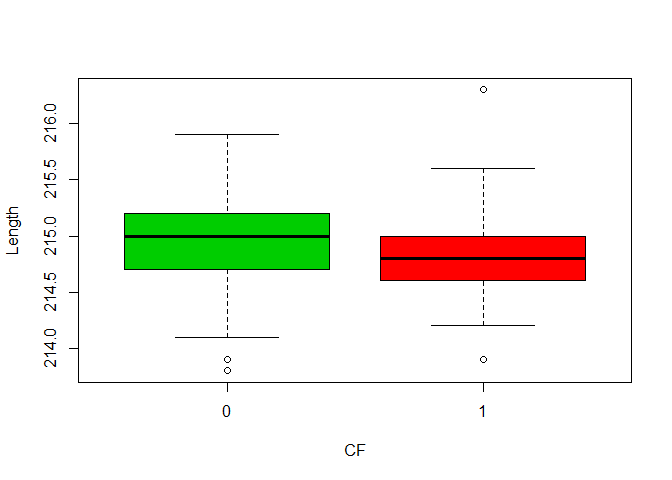
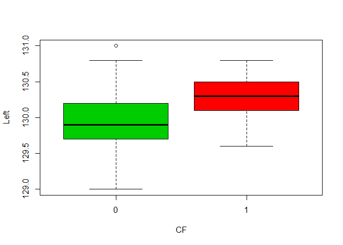
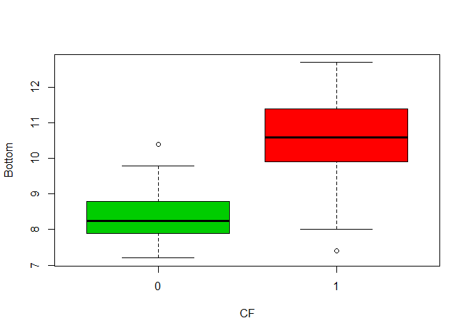
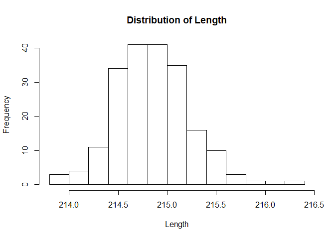
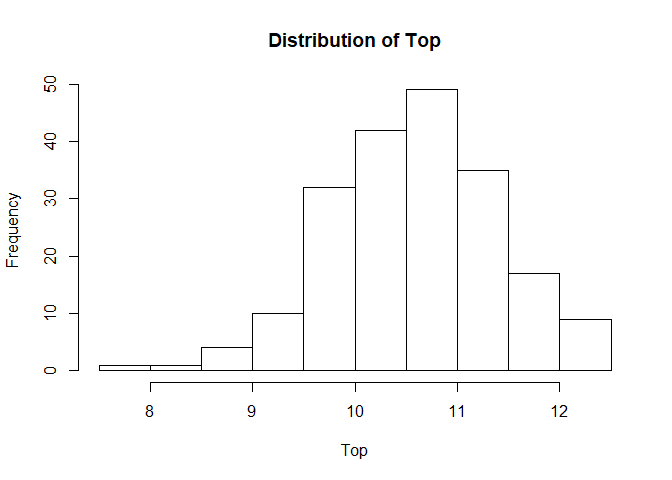
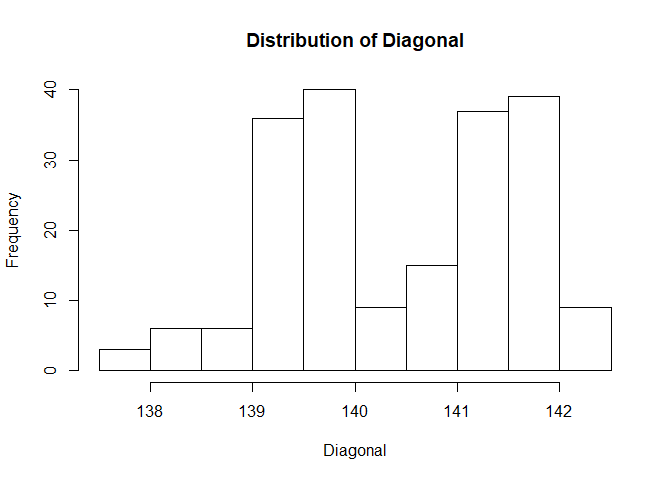
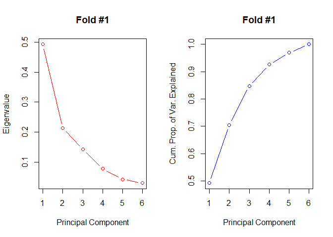
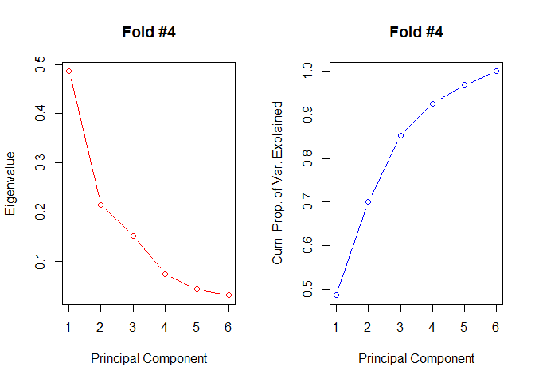
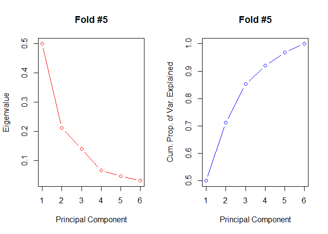

Counterfeit Bank Note Detection
================
Jared Thach
3/17/2021

# Synopsis:

#### Introduction and Objective

In this project, we will attempt to predict/detect counterfeit Swiss
1000-franc bank notes using a variety of methods, such as Linear
Discriminant Analysis, Logistic Regression, and Factor Analysis, and
select the best performing model for final prediction/detection. Our
models will be the following:

  - Linear discriminant analysis (LDA)
  - Logistic regression
  - Factor analysis and LDA
  - Factor analysis and logistic regression

However before doing so, we will explore our data with scatterplots,
level plots, and boxplots and then proceed to prepare our data for
cross-fold validation. At the end, we will evaluate our models’
performances across all folds.

#### Conclusion

Overall, our several models yielded similar results in terms of
validation accuracies, only varying between 95% and 100% across folds
and across methodologies. Our baseline LDA model appears to perform the
best across all folds; it has the **highest accuracy of \(\approx\)
100%** and does not require additional computation and data manipulation
as with factor analysis. By adopting this final model which strictly
uses linear discriminant analysis, we are able to successfully
**predict/detect counterfeit Swiss 1000-franc bank notes at an accuracy
rate between 95% and 100%**.

#### Methods Used

  - Data Visualization
  - Cross-Fold Validation
  - Linear Discriminant Analysis
  - Logistic Regression
  - Factor Analysis

#### Technologies

  - R Programming

#### Contributors

  - Jared Thach - github/jared8thach
  - “Multivariate Statistics: A practical approach”, by Bernhard Flury
    and Hans Riedwyl, Chapman and Hall, 1988.

-----

# Table of Contents

1)  <a href='#Sec 1'>Importing Libraries and Dataset</a>
2)  <a href='#Sec 2'>Exploratory Data Analysis (EDA)</a>
      - Scatterplots
      - Level Plot
      - Boxplots
3)  <a href='#Sec 3'>Splitting Data for Cross-Fold Validation</a>
4)  <a href='#Sec 4'>Linear Discriminant Analysis (LDA)</a>
      - Assumptions
      - Procedure
      - Performance
5)  <a href='#Sec 5'>Logistic Regression</a>
      - Assumptions
      - Procedure
      - Performance
6)  <a href='#Sec 6'>Factor Analysis</a>
      - Assumptions
      - Choosing Number of Factors Using Scree Plots
      - Procedure
          - 6a) <a href='#Sec 6-3a'>Factor Analysis and LDA</a>
              - Performance
          - 6b) <a href='#Sec 6-3b'>Factor Analysis and Logistic
            Regression</a>
              - Performance
7)  <a href='#Sec 7'>Evaluating Performance</a>
8)  <a href='#Sec 8'>Conclusion</a>

# 1\) <a id='Sec 1'>Importing Libraries and Dataset</a>

``` r
sbn = read.csv('SBN.txt', sep='')
head(sbn)
```

    ##     Length  Left Right Bottom  Top Diagonal
    ## BN1  214.8 131.0 131.1    9.0  9.7    141.0
    ## BN2  214.6 129.7 129.7    8.1  9.5    141.7
    ## BN3  214.8 129.7 129.7    8.7  9.6    142.2
    ## BN4  214.8 129.7 129.6    7.5 10.4    142.0
    ## BN5  215.0 129.6 129.7   10.4  7.7    141.8
    ## BN6  215.7 130.8 130.5    9.0 10.1    141.4

*Source*: Dataset of Swiss 1000-franc bank notes from “Multivariate
Statistics: A practical approach”, by Bernhard Flury and Hans Riedwyl,
Chapman and Hall, 1988.\[^1\]

This dataset contains 100 genuine and 100 counterfeit Swiss 1000-franc
bank notes, each with measurements of note length, left-hand width,
right-hand width, bottom margin, top margin, and diagonal length. Using
these measurements, we can fit our various predictive models.

For ease of analysis with this project, we will add a new column `CF`
which indicates whether or not the bank note was counterfeit (1 for
counterfeit and 0 for genuine). The first 100 observations are genuine
while the second 100 observations are counterfeit.

``` r
sbn$CF = c(rep(0, 100), rep(1, 100))
head(sbn)
```

    ##     Length  Left Right Bottom  Top Diagonal CF
    ## BN1  214.8 131.0 131.1    9.0  9.7    141.0  0
    ## BN2  214.6 129.7 129.7    8.1  9.5    141.7  0
    ## BN3  214.8 129.7 129.7    8.7  9.6    142.2  0
    ## BN4  214.8 129.7 129.6    7.5 10.4    142.0  0
    ## BN5  215.0 129.6 129.7   10.4  7.7    141.8  0
    ## BN6  215.7 130.8 130.5    9.0 10.1    141.4  0

# 2\) <a id='Sec 2'>Exploratory Data Analysis (EDA)</a>

We will briefly view the pairs plot for this dataset:

``` r
pairs(sbn)
```

<!-- -->

Another great visualization for this dataset is a level plot. This level
plot will show correlations between all pairs of variables and
distinguish each pair according to their correlation strength and
whether or not it is positive or negative.

``` r
library(lattice)
library(ellipse)

cor_df = cor(sbn)

# Function to generate correlation plot
panel.corrgram <- function(x, y, z, subscripts, at, level = 0.9, label = FALSE, ...) {
     require("ellipse", quietly = TRUE)
     x <- as.numeric(x)[subscripts]
     y <- as.numeric(y)[subscripts]
     z <- as.numeric(z)[subscripts]
     zcol <- level.colors(z, at = at,  ...)
     for (i in seq(along = z)) {
         ell=ellipse(z[i], level = level, npoints = 50, 
                     scale = c(.2, .2), centre = c(x[i], y[i]))
         panel.polygon(ell, col = zcol[i], border = zcol[i], ...)
     }
     if (label)
         panel.text(x = x, y = y, lab = 100 * round(z, 2), cex = 0.8,
                    col = "black")
 }

# Generate correlation plot
print(levelplot(cor_df[seq(7,1), seq(7,1)], at = do.breaks(c(-1.01, 1.01), 20),
           xlab = NULL, ylab = NULL, colorkey = list(space = "top"), col.regions=rev(heat.colors(100)),
           scales = list(x = list(rot = 90)),
           panel = panel.corrgram, label = TRUE))
```

<!-- -->

Now, we may decide to look at each feature separately via boxplots.

``` r
# plotting `Length`
boxplot(Length~CF, data=sbn, col=c(3,2))
```

<!-- -->

``` r
# plotting `Left`
boxplot(Left~CF, data=sbn, col=c(3,2))
```

<!-- -->

``` r
# plotting `Right`
boxplot(Right~CF, data=sbn, col=c(3,2))
```

<!-- -->

``` r
# plotting `Bottom`
boxplot(Bottom~CF, data=sbn, col=c(3,2))
```

<!-- -->

``` r
# plotting `Top`
boxplot(Top~CF, data=sbn, col=c(3,2))
```

<!-- -->

``` r
# plotting `Diagonal`
boxplot(Diagonal~CF, data=sbn, col=c(3,2))
```

<!-- -->

We can also calculate the sample statistics of each these features,
broken down by counterfeit, or `CF`.

``` r
CF_0 = sbn[sbn['CF'] == 0,]
CF_1 = sbn[sbn['CF'] == 1,]

sample_stats = rbind(colMeans(CF_0), colMeans(CF_1))
sample_stats
```

    ##       Length    Left   Right Bottom    Top Diagonal CF
    ## [1,] 214.969 129.943 129.720  8.305 10.168  141.517  0
    ## [2,] 214.823 130.300 130.193 10.530 11.133  139.450  1

After viewing these boxplots and this table of sample statistics, we can
see that for counterfeit bank notes (`CF == 1`):

  - The distributions of `Left`, `Right`, `Bottom`, and `Top` have much
    **higher centers**
  - The distribution of `Diagonal` has a much **lower center**

Whereas for genuine bank notes (`CF == 0`):

  - The distributions of `Left`, `Right`, `Bottom`, and `Top` margins
    have much **lower centers**
  - The distribution of `Diagonal` length has a much **higher center**

The only feature that sees no difference among the two groups is
`Length`.

Also, based on our level plot:

  - `Left`, `Right`, `Bottom`, `Top`, are **strongly and positively
    correlated** with `CF`
  - `Diagonal` is **strongly and negatively correlated** with `CF`

Therefore, we may want to pay particular attention to these features of
`Left`, `Right`, `Bottom`, `Top`, and `Diagonal` in our proceeding
analysis.

# 3\) <a id='Sec 3'>Splitting Data for Cross-Fold Validation</a>

``` r
set.seed(99)

# 5 folds each with size of 40
k = 5
n = nrow(sbn) / k

# shuffling data frame
sbn = sbn[sample.int(nrow(sbn), replace=FALSE),]

# getting indexes for each k fold
indexes = c()
for (i in 1:k) {
  index = (1+(i-1)*n):(n+(i-1)*n)
  indexes = c(indexes, list(index))
}

# splitting into k validation and training sets
validation_1 = sbn[indexes[[1]],]
validation_2 = sbn[indexes[[2]],]
validation_3 = sbn[indexes[[3]],]
validation_4 = sbn[indexes[[4]],]
validation_5 = sbn[indexes[[5]],]
training_1 = sbn[-indexes[[1]],]
training_2 = sbn[-indexes[[2]],]
training_3 = sbn[-indexes[[3]],]
training_4 = sbn[-indexes[[4]],]
training_5 = sbn[-indexes[[5]],]
```

# 4\) <a id='Sec 4'>Linear Discriminant Analysis</a>

### Assumptions

Before we conduct our linear discriminant analysis, we must identify and
discuss some assumptions:

1.  The dataset has observed **common mean vectors**
    \(\underline{\mu_k}\) for each group/class \(k\)
2.  The data is **homoskedastic**, in that the data from all
    groups/classes have a common covariance matrix of
    \({\mathbf \Sigma}\) where \[
      {\mathbf \Sigma} = \mbox{Cov} [ \underline{x}_i^{(k)}, \underline{x}_i^{(k)}]
    \]
3.  The data is **independently sampled**
4.  The data is roughly **multivariate normally distributed**

In attempt to justify these assumptions, we see that our dataset indeed
has common mean vectors as well as a common covariance matrix. It is
unclear whether or not the data is independently sample, as we are not
explicitly informed. Finally, based on the histograms below, our data is
**not multivariate normally distributed**, as the distribution of
`Diagonal` follows a bimodal pattern.

``` r
# plotting `Length`
hist(sbn$Length,
     xlab='Length',
     main='Distribution of Length')
```

<!-- -->

``` r
# plotting `Top`
hist(sbn$Top,
     xlab='Top',
     main='Distribution of Top')
```

<!-- -->

``` r
# plotting `Diagonal`
hist(sbn$Diagonal,
     xlab='Diagonal',
     main='Distribution of Diagonal')
```

<!-- -->

### Procedure

In order to build our linear discriminant function, recall the formula
to compute the linear discriminant value, \(d_k^{L}(\underline{x})\) for
a single observation vector, \(\underline{x}\) using \(\alpha_k\) and
\(\underline{\beta}_k\)\[^3\]:

We will now define a function that performs this linear discrimant
analysis to predict whether or not a bill is counterfeit (`CF`), given a
training and validation set.

``` r
LDA = function(train, val) {
  
  # getting count of each class
  n_CF_0 = length(train$CF) - sum(train$CF)
  n_CF_1 = sum(train$CF)

  # getting prior probabilities
  p_CF_0 = mean(train$CF)
  p_CF_1 = 1 - p_CF_0

  # getting sample mean vectors
  mean_CF_0 = colMeans(train[train$CF == 0,c(-7)])
  mean_CF_1 = colMeans(train[train$CF == 1,c(-7)])
  sample_means = rbind(mean_CF_0, mean_CF_1)

  # getting pooled sample covariance
  s_CF_0 = cov(train[train$CF==0,c(-7)])
  s_CF_1 = cov(train[train$CF==1,c(-7)])
  s_pooled = ((n_CF_0-1)*s_CF_0 + (n_CF_1-1)*s_CF_1) / (n_CF_0 + n_CF_1 - 2)
  
  # calculating coefficients alpha and beta
  s_inv = solve(s_pooled)
  
  # alpha
  alpha_CF_0 = -0.5*t(mean_CF_0) %*% s_inv %*% mean_CF_0 + log(p_CF_0)
  alpha_CF_1 = -0.5*t(mean_CF_1) %*% s_inv %*% mean_CF_1 + log(p_CF_1)
  
  # beta
  beta_CF_0 = s_inv %*% mean_CF_0
  beta_CF_1 = s_inv %*% mean_CF_1

  # predicting validation set
  prediction = c()
  label = c(0,1)
  
  for (i in 1:nrow(val)) {

    # single observation
    x = t(val[i,c(-7)])

    # calculating linear discriminant function
    d_CF_0 = alpha_CF_0 + t(beta_CF_0) %*% x
    d_CF_1 = alpha_CF_1 + t(beta_CF_1) %*% x

    # classifying observation as class with greatest LD value
    d_vec = c(d_CF_0, d_CF_1)
    prediction = append(prediction, label[which.max(d_vec)])
  }

  # adding prediction column to validation set
  output = data.frame(val)
  output$prediction = prediction
  
  return(output)
}

# LDA on fold #1
head(LDA(training_1, validation_1))
```

    ##       Length  Left Right Bottom  Top Diagonal CF prediction
    ## BN176  214.9 130.4 130.2   11.9 10.7    139.0  1          1
    ## BN33   215.0 130.0 129.6    7.7 10.5    140.7  0          0
    ## BN44   214.9 130.4 129.7    9.0  9.8    140.9  0          0
    ## BN22   215.6 130.5 130.0    8.1 10.3    141.6  0          0
    ## BN117  214.7 130.6 130.1   11.8 10.5    139.8  1          1
    ## BN106  215.0 130.2 130.2   10.6 10.7    139.9  1          1

### Performance

Next, we will compute the validation accuracies on the 5 folds and
record these values in a data frame, `performance`.

``` r
performance = data.frame(row.names=c('fold_1', 'fold_2', 'fold_3', 'fold_4', 'fold_5' ))

acc_1 = mean(validation_1$CF == LDA(training_1, validation_1)$prediction)
acc_2 = mean(validation_2$CF == LDA(training_2, validation_2)$prediction)
acc_3 = mean(validation_3$CF == LDA(training_3, validation_3)$prediction)
acc_4 = mean(validation_4$CF == LDA(training_4, validation_4)$prediction)
acc_5 = mean(validation_5$CF == LDA(training_5, validation_5)$prediction)

performance$LDA_acc = c(acc_1, acc_2, acc_3, acc_4, acc_5)
performance
```

    ##        LDA_acc
    ## fold_1   1.000
    ## fold_2   1.000
    ## fold_3   1.000
    ## fold_4   0.975
    ## fold_5   1.000

# 5\) <a id='Sec 5'>Logistic Regression</a>

### Assumptions

Like LDA, we must identify and discuss some various model assumptions:

1.  Observations must have a **binary or qualitative dependent
    variable**
2.  Data is **independently sampled**

In discussing these assumptions, it is clear that our data does indeed
have a binary dependent variable. Each bank note has a feature of
counterfeit, or `CF`, which can take on a binary value of `0` or `1`.
However, it is unclear whether or not our data is truly independently
sampled because we are not explicitly informed.

### Procedure

``` r
logistic = function(train, val) {
  
  # getting our features and target
  y = train$CF
  length = train$Length
  left = train$Left
  right = train$Right
  bottom = train$Bottom
  top = train$Top
  diagonal = train$Diagonal
  
  # creating a multiple logistic regression model
  all.fit = glm(y~length+left+right+bottom+top+diagonal, data=train, family=binomial)
  
  # creating prediction function
prob = function(x){
  x = c(1,x)
  probability = as.numeric(as.numeric(x %*% all.fit$coefficients))
  probability = 1 / (1+exp(-probability))
  return(probability)
}

  # applying prediction function to validation set and adding probability and prediction columns
  thresh = 0.90
  probability = apply(val[,c(-7)], FUN=prob, 1)
  prediction = as.numeric(probability > thresh)
  
  output = data.frame(val)
  output$probability = probability
  output$prediction = prediction
  
  return(output)
}

# logistic regression on fold #1
head(logistic(training_1, validation_1))
```

    ##       Length  Left Right Bottom  Top Diagonal CF  probability prediction
    ## BN176  214.9 130.4 130.2   11.9 10.7    139.0  1 1.000000e+00          1
    ## BN33   215.0 130.0 129.6    7.7 10.5    140.7  0 3.132216e-52          0
    ## BN44   214.9 130.4 129.7    9.0  9.8    140.9  0 3.278554e-40          0
    ## BN22   215.6 130.5 130.0    8.1 10.3    141.6  0 9.280575e-55          0
    ## BN117  214.7 130.6 130.1   11.8 10.5    139.8  1 1.000000e+00          1
    ## BN106  215.0 130.2 130.2   10.6 10.7    139.9  1 1.000000e+00          1

### Performance

Next, we will compute the validation accuracies on the 5 folds and
record these values in a data frame, `performance`.

``` r
acc_1 = mean(validation_1$CF == logistic(training_1, validation_1)$prediction)
acc_2 = mean(validation_2$CF == logistic(training_2, validation_2)$prediction)
acc_3 = mean(validation_3$CF == logistic(training_3, validation_3)$prediction)
acc_4 = mean(validation_4$CF == logistic(training_4, validation_4)$prediction)
acc_5 = mean(validation_5$CF == logistic(training_5, validation_5)$prediction)

performance$logistic_acc = c(acc_1, acc_2, acc_3, acc_4, acc_5)
performance
```

    ##        LDA_acc logistic_acc
    ## fold_1   1.000        1.000
    ## fold_2   1.000        0.975
    ## fold_3   1.000        1.000
    ## fold_4   0.975        0.975
    ## fold_5   1.000        1.000

# 6\) <a id='Sec 6'>Factor Analysis</a>

### Assumptions

Before running our factor analysis, there are some assumptions we must
consider:

1.  The data is **independently sampled** from a multivariate normal
    distribution
2.  The data is centered around the mean vector \(\underline{\mu}\)
3.  The data has an observed variance-covariance matrix
    \({\bf \Sigma}\).
4.  The data has a collection of **latent variables** that can explain
    the variance

The data does indeed have an observed variance-covariance matrix and is
centered around its column means. Also, our data can be broken down into
its latent variables, as we will see in the proceeding section. However,
it is unclear whether or not the data is independently sampled because
it is not explicitly defined and just like with our LDA assumption of
multivariate normal distribution, this assumption does not hold because
of the bimodal nature of `Diagonal`.

### Choosing Number of Factors Using Scree Plots

In order to run our factor analysis, we must be able to determine the
number of factors we believe are best to use. We will use PCA and scree
plots to discern the best number of factors.

``` r
# function to generate scree plot
scree = function(train, fold) {
  
  # formatting graph
  par(mfrow=c(1,2))
  
  # eigenvalue decomposition
  pca_result = prcomp(train[,c(-7)], scale=TRUE)
  eigen_value = pca_result$sdev^2
  prop_eigen = eigen_value / sum(eigen_value)
  
  # creating scree plot
  plot(prop_eigen,
       xlab='Principal Component',
       ylab='Eigenvalue',
       main=sprintf('Fold #%i', fold),
       type='b',
       col='red')
  
  # creating cumulative proportion plot
  plot(cumsum(prop_eigen),
       xlab='Principal Component',
       ylab='Cum. Prop. of Var. Explained',
       main=sprintf('Fold #%i', fold),
       type='b',
       col='blue')
}

# generating plots for each fold
scree(training_1, 1)
```

<!-- -->

``` r
scree(training_2, 2)
```

<!-- -->

``` r
scree(training_3, 3)
```

<!-- -->

``` r
scree(training_4, 4)
```

<!-- -->

``` r
scree(training_5, 5)
```

<!-- -->

These plots indicate that for *all* folds, choosing a factor model with
\(m=2\) factors may be the best approach. This is because for each fold,
the “elbow” is met at **2 principal components**. By choosing this
“elbow” we ensure that we are efficiently explaining more of the
variance with a select number of factors while avoiding other
unnecessary additional factors.

### Procedure

``` r
factanal(training_1[,-c(7)], factors=2, rotation='varimax')
```

    ## 
    ## Call:
    ## factanal(x = training_1[, -c(7)], factors = 2, rotation = "varimax")
    ## 
    ## Uniquenesses:
    ##   Length     Left    Right   Bottom      Top Diagonal 
    ##    0.813    0.183    0.291    0.596    0.615    0.005 
    ## 
    ## Loadings:
    ##          Factor1 Factor2
    ## Length   -0.155   0.404 
    ## Left      0.514   0.744 
    ## Right     0.528   0.656 
    ## Bottom    0.619   0.144 
    ## Top       0.618         
    ## Diagonal -0.997         
    ## 
    ##                Factor1 Factor2
    ## SS loadings      2.327   1.170
    ## Proportion Var   0.388   0.195
    ## Cumulative Var   0.388   0.583
    ## 
    ## Test of the hypothesis that 2 factors are sufficient.
    ## The chi square statistic is 39.61 on 4 degrees of freedom.
    ## The p-value is 5.2e-08

Also, upon viewing the factor analysis summary of fold \#1 using \(m=2\)
factors, we see that

1.  Our first factor loads heavily on `Left`, `Right`, `Bottom`, `Top`,
    and `Diagonal` with loadings of 0.537, 0.560, 0.640, 0.586, and
    -0.996, respectively
2.  Our second factor loads heavily only on `Length`, `Left`, and
    `Right` with loadings of 0.411, 0.751, and 0.616, respectively

# 6a) <a id='Sec 6-3a'>Factor Analysis and Linear Discriminant Analysis</a>

Finally, we will perform factor analysis on each fold using \(m=2\)
factors and then fit the factor loading scores first to our linear
discrimant model. We will use the same linear discriminant function
(`LDA`) as before, however, with minor tweaks to adjust for number of
features. Afterwards, we will perform this same procedure but fit it to
our logistic regression model.

``` r
fact_LDA = function(train_df, val_df) {
  
  train = data.frame(train_df)
  val = data.frame(val_df)
  
  # conducting factor analysis with 2 factors and getting loadings
  fact = factanal(train[,-c(7)], factors=2, rotation='varimax')
  loadings = fact$loadings[,1:2]
  
  # using factor loadings to reduce dimensions: 6 -> 2
  train = data.frame(as.matrix(train[,c(-7)]) %*% loadings)
  train$CF = train_df$CF
  val = data.frame(as.matrix(val[,c(-7)]) %*% loadings)
  val$CF = val_df$CF
  
  # getting count of each class
  n_CF_0 = length(train$CF) - sum(train$CF)
  n_CF_1 = sum(train$CF)

  # getting prior probabilities
  p_CF_0 = mean(train$CF)
  p_CF_1 = 1 - p_CF_0

  # getting sample mean vectors
  mean_CF_0 = colMeans(train[train$CF == 0,c(-3)])
  mean_CF_1 = colMeans(train[train$CF == 1,c(-3)])
  sample_means = rbind(mean_CF_0, mean_CF_1)

  # getting pooled sample covariance
  s_CF_0 = cov(train[train$CF==0,c(-3)])
  s_CF_1 = cov(train[train$CF==1,c(-3)])
  s_pooled = ((n_CF_0-1)*s_CF_0 + (n_CF_1-1)*s_CF_1) / (n_CF_0 + n_CF_1 - 2)

  # calculating coefficients alpha and beta
  s_inv = solve(s_pooled)

  # alpha
  alpha_CF_0 = -0.5*t(mean_CF_0) %*% s_inv %*% mean_CF_0 + log(p_CF_0)
  alpha_CF_1 = -0.5*t(mean_CF_1) %*% s_inv %*% mean_CF_1 + log(p_CF_1)

  # beta
  beta_CF_0 = s_inv %*% mean_CF_0
  beta_CF_1 = s_inv %*% mean_CF_1

  # predicting validation set
  prediction = c()
  label = c(0,1)

  for (i in 1:nrow(val)) {

    # single observation
    x = t(val[i,c(-3)])

    # calculating linear discriminant function
    d_CF_0 = alpha_CF_0 + t(beta_CF_0) %*% x
    d_CF_1 = alpha_CF_1 + t(beta_CF_1) %*% x

    # classifying observation as class with greatest LD value
    d_vec = c(d_CF_0, d_CF_1)
    prediction = append(prediction, label[which.max(d_vec)])
  }

  # adding prediction column to validation set
  output = data.frame(val)
  output$prediction = prediction

  return(output)
}

# factor analysis and LDA on fold #1
head(fact_LDA(training_1, validation_1))
```

    ##         Factor1  Factor2 CF prediction
    ## BN176 -22.14815 274.4147  1          1
    ## BN33  -27.10567 273.1859  0          0
    ## BN44  -26.65903 273.6637  0          0
    ## BN22  -27.50390 274.1290  0          0
    ## BN117 -23.05054 274.4096  1          1
    ## BN106 -23.96899 274.1388  1          1

### Performance

Calculating the validation accuracies for each fold using this Factor
Analysis + LDA approach and appending to `performance`:

``` r
acc_1 = mean(validation_1$CF == fact_LDA(training_1, validation_1)$prediction)
acc_2 = mean(validation_2$CF == fact_LDA(training_2, validation_2)$prediction)
acc_3 = mean(validation_3$CF == fact_LDA(training_3, validation_3)$prediction)
acc_4 = mean(validation_4$CF == fact_LDA(training_4, validation_4)$prediction)
acc_5 = mean(validation_5$CF == fact_LDA(training_5, validation_5)$prediction)

performance$fact_LDA_acc = c(acc_1,acc_2,acc_3,acc_4,acc_5)
performance
```

    ##        LDA_acc logistic_acc fact_LDA_acc
    ## fold_1   1.000        1.000        1.000
    ## fold_2   1.000        0.975        1.000
    ## fold_3   1.000        1.000        1.000
    ## fold_4   0.975        0.975        0.975
    ## fold_5   1.000        1.000        1.000

# 6b) <a id='Sec 6-3b'>Factor Analysis and Logistic Regression</a>

Now, we will use factor analysis and then fit our reduced data to our
logistic regression function (`logistic`) to predict our counterfeit
bank notes - with minor tweaks to the function.

``` r
fact_logistic = function(train_df, val_df) {
  
  train = data.frame(train_df)
  val = data.frame(val_df)
  
  # conducting factor analysis with 2 factors and getting loadings
  fact = factanal(train[,-c(7)], factors=2, rotation='varimax')
  loadings = fact$loadings[,1:2]
  
  # using factor loadings to reduce dimensions: 6 -> 2
  train = data.frame(as.matrix(train[,c(-7)]) %*% loadings)
  train$CF = train_df$CF
  val = data.frame(as.matrix(val[,c(-7)]) %*% loadings)
  val$CF = val_df$CF
  
  # getting our features and target
  y = train$CF
  factor_1 = train[,c(1)]
  factor_2 = train[,c(2)]
  
  # creating a multiple logistic regression model
  all.fit = glm(y~factor_1+factor_2, data=train, family=binomial)
  
  # creating prediction function
prob = function(x){
  x = c(1,x)
  probability = as.numeric(as.numeric(x %*% all.fit$coefficients))
  probability = 1 / (1+exp(-probability))
  return(probability)
}

  # applying prediction function to validation set and adding probability and prediction columns
  thresh = 0.90
  probability = apply(val[,c(-3)], FUN=prob, 1)
  prediction = as.numeric(probability > thresh)
  
  output = data.frame(val)
  output$probability = probability
  output$prediction = prediction
  
  return(output)
}

# factor analysis and logistic regression on fold #1
head(fact_logistic(training_1, validation_1))
```

    ##         Factor1  Factor2 CF   probability prediction
    ## BN176 -22.14815 274.4147  1  1.000000e+00          1
    ## BN33  -27.10567 273.1859  0 8.225244e-169          0
    ## BN44  -26.65903 273.6637  0 8.711040e-121          0
    ## BN22  -27.50390 274.1290  0 5.274698e-156          0
    ## BN117 -23.05054 274.4096  1  1.000000e+00          1
    ## BN106 -23.96899 274.1388  1  1.000000e+00          1

### Performance

Calculating the validation accuracies for each fold using this Factor
Analysis + Logistic Regression approach and appending to `performance`:

``` r
acc_1 = mean(validation_1$CF == fact_logistic(training_1, validation_1)$prediction)
acc_2 = mean(validation_2$CF == fact_logistic(training_2, validation_2)$prediction)
acc_3 = mean(validation_3$CF == fact_logistic(training_3, validation_3)$prediction)
acc_4 = mean(validation_4$CF == fact_logistic(training_4, validation_4)$prediction)
acc_5 = mean(validation_5$CF == fact_logistic(training_5, validation_5)$prediction)

performance$fact_logistic_acc = c(acc_1, acc_2, acc_3, acc_4, acc_5)
performance
```

    ##        LDA_acc logistic_acc fact_LDA_acc fact_logistic_acc
    ## fold_1   1.000        1.000        1.000             1.000
    ## fold_2   1.000        0.975        1.000             0.975
    ## fold_3   1.000        1.000        1.000             1.000
    ## fold_4   0.975        0.975        0.975             0.975
    ## fold_5   1.000        1.000        1.000             0.950

# 7\) <a id='Sec 7'>Evaluating Performance</a>

``` r
performance
```

    ##        LDA_acc logistic_acc fact_LDA_acc fact_logistic_acc
    ## fold_1   1.000        1.000        1.000             1.000
    ## fold_2   1.000        0.975        1.000             0.975
    ## fold_3   1.000        1.000        1.000             1.000
    ## fold_4   0.975        0.975        0.975             0.975
    ## fold_5   1.000        1.000        1.000             0.950

Viewing our final `performance` table, we can see that performing factor
analysis prior to LDA and logistic regression does not exactly yield
better results, as the baseline LDA and logistic regression models
already have high accuracy rates. In fact, performing factor analysis +
logistic regression reduces the accuracy of our validation set by 5% in
fold \#5 (although, quite minor). Additionally, performing factor
analysis requires a bit more dimension manipulation to our dataset in
our `LDA` and `logistic` functions and more general computation, and
therefore, performing **factor analysis does not help (i.e., it is a
“waste of time”)**. Factor analysis is a neat technique, however with
our Swiss bank notes dataset, it does not improve our model accuracies
and performing a simple LDA may be sufficient enough. The **final
models** that we have for each fold and their validation accuracies are
as follows:

  - Fold \#1: Linear Discriminant Analysis (100%)
  - Fold \#2: Linear Discriminant Analysis (100%)
  - Fold \#3: Linear Discriminant Analysis (100%)
  - Fold \#4: Linear Discriminant Analysis (97.5%)
  - Fold \#5: Linear Discriminant Analysis (100%)

where `fact_LDA_acc` and `fact_logistic_acc` refer to our LDA and
logistic regression models which use factor analysis prior to predicting
counterfeit, or `CF`, with LDA or logistic regression.

# 8\) <a id='Sec 8'>Conclusion</a>

Overall, our several models yielded similar results in terms of
validation accuracies, only varying between 95% and 100% across folds
and across methodologies. Our baseline LDA model appears to perform the
best across all folds; it has the **highest accuracy of \(\approx\)
100%** and does not require additional computation and data manipulation
as with factor analysis. By adopting this final model which strictly
uses only linear discriminant analysis, we will be able to successfully
**predict/detect counterfeit Swiss 1000-franc bank notes at an accuracy
rate between 95% and 100%**.
